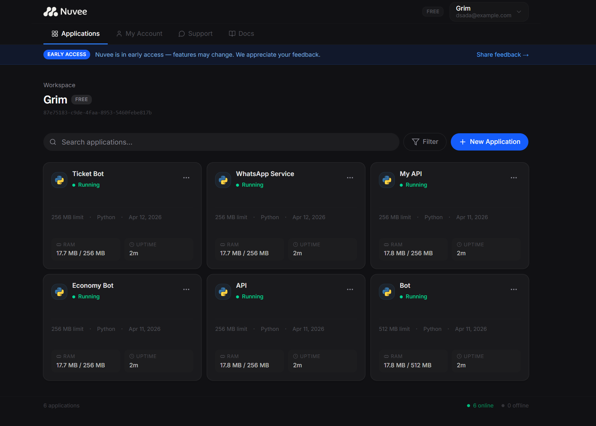
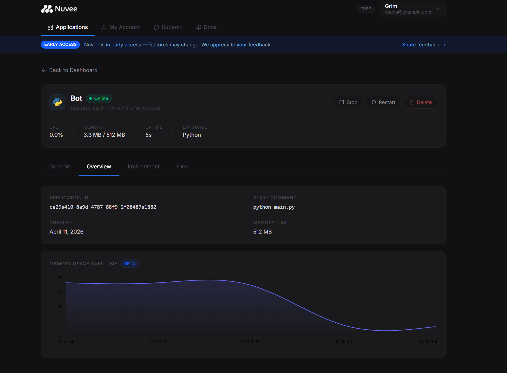
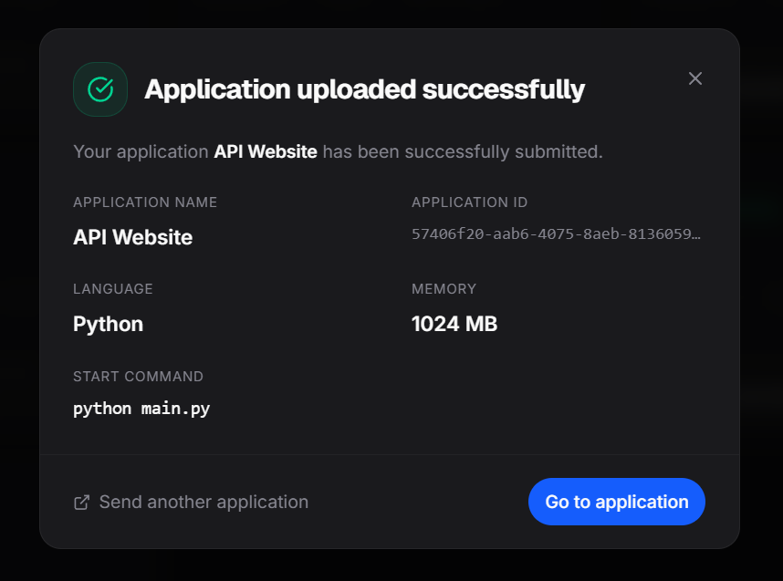
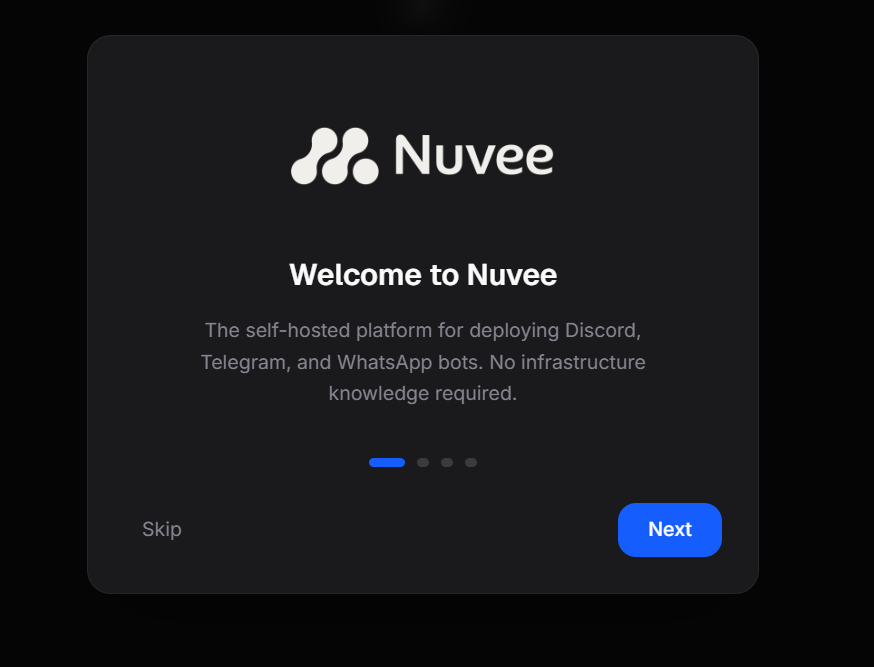
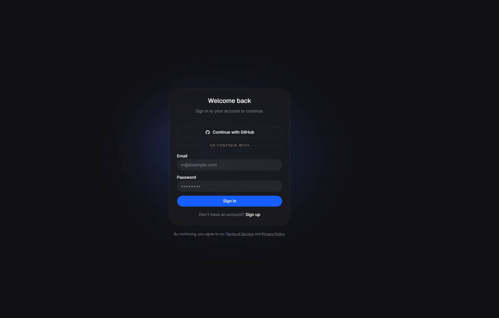

<div align="center">
  

  ### The self-hosted platform for apps deployment

  Zip your project. Upload it. Your app is live in seconds.

  [](https://github.com/joaojpn/docklys-hosting/blob/main/LICENSE)
  
  
  

  [Website](https://docklys.io) · [Discord](https://discord.gg/ke5V4NeQ49) · [Getting Started](#-getting-started) · [Contributing](CONTRIBUTING.md)
</div>

---

## What is Nuvee Cloud?

Nuvee Cloud is an open-source, self-hosted platform for deploying Discord, Telegram, and WhatsApp bots. No infrastructure knowledge required — just zip your project, upload it, and Docklys handles the rest.

```
your-bot/
├── main.py           # your code
└── requirements.txt  # your dependencies
```

**Zip it. Upload it. Done.**

> [!NOTE]
> Nuvee is in active development. Features and APIs may change between versions.

---

## Screenshots

<div align="center">
  
  <p><em>Dashboard — manage and monitor all your applications in real time</em></p>

  <br />

  
  <p><em>Bot Details — live logs, CPU/RAM monitoring and built-in file editor</em></p>

  <br />

  
  <p><em>Deploy applications via zip upload with drag and drop</em></p>

  
  <p><em>Onboarding dialog shown on first login</em></p>

  
  <p><em>Authentication — GitHub OAuth and email/password</em></p>
</div>

---

## Features

| Feature | Description |
|---|---|
| **Zero-config deploys** | Upload a `.zip`, no configuration files required |
| **Full isolation** | Every bot runs in its own Docker container with memory limits |
| **Multi-language** | Python and Node.js detected and configured automatically |
| **Live logs** | Real-time log streaming via Server-Sent Events |
| **File editor** | View and edit bot files directly in the dashboard (Monaco Editor) |
| **Environment variables** | Securely manage tokens and secrets per application |
| **RAM chart** | Visualize memory usage over time |
| **GitHub OAuth** | Sign in with GitHub or email and password |
| **Self-hosted** | Your server, your data, your rules |
| **Open source** | MIT licensed, forever free |

---

## 🚀 Getting Started

### One-command install (Ubuntu/Debian)

```bash
curl -fsSL https://raw.githubusercontent.com/joaojpn/docklys-hosting/main/install.sh | sudo bash
```

<details>
<summary>Manual setup</summary>

> **Prerequisites:** Docker, Node.js 20+, pnpm

```bash
# 1. Clone the repository
git clone https://github.com/joaojpn/docklys-hosting.git
cd docklys-hosting

# 2. Install dependencies
pnpm install

# 3. Start the database and storage
docker compose up -d

# 4. Set up environment variables
cp apps/api/.env.example apps/api/.env
cp apps/web/.env.example apps/web/.env
# Edit both .env files with your settings

# 5. Run database migrations
cd apps/api && pnpx prisma migrate dev

# 6. Start the development environment
cd ../.. && pnpm dev
```

Open [http://localhost:5173](http://localhost:5173) to access the dashboard.

</details>

> [!IMPORTANT]
> Make sure Docker is running before starting the development environment.

---

## Stack

| Layer | Technology |
|---|---|
| Frontend | React, TypeScript, Tailwind CSS, shadcn/ui, framer-motion |
| Backend | Fastify, Node.js, TypeScript |
| Database | PostgreSQL, Prisma |
| Storage | MinIO |
| Containers | Docker, Dockerode |
| Auth | JWT, GitHub OAuth |
| Editor | Monaco Editor |

---

## Monorepo Structure

```
docklys-hosting/
├── apps/
│   ├── web/          # React frontend (Vite + TypeScript)
│   └── api/          # Fastify backend (Node.js + TypeScript)
├── docs/             # Documentation and assets
└── .github/          # CI/CD, issue templates, PR template
```

---

---

## Contributing

Contributions are welcome! Please read [CONTRIBUTING.md](CONTRIBUTING.md) before opening a pull request.

- 🐛 Found a bug? [Open an issue](https://github.com/joaojpn/docklys-hosting/issues/new?template=bug_report.yml)
- 💡 Have an idea? [Request a feature](https://github.com/joaojpn/docklys-hosting/issues/new?template=feature_request.yml)
- 💬 Want to chat? [Join our Discord](https://discord.gg/ke5V4NeQ49)

> [!WARNING]
> Please do not open public issues for security vulnerabilities. Read [SECURITY.md](SECURITY.md) first.

---

## 📄 License

Docklys is open-source software licensed under the [MIT License](LICENSE).

---

<div align="center">
  <sub>Built with ❤️ by <a href="https://github.com/joaojpn">joaojpn</a> and contributors.</sub>
</div>
